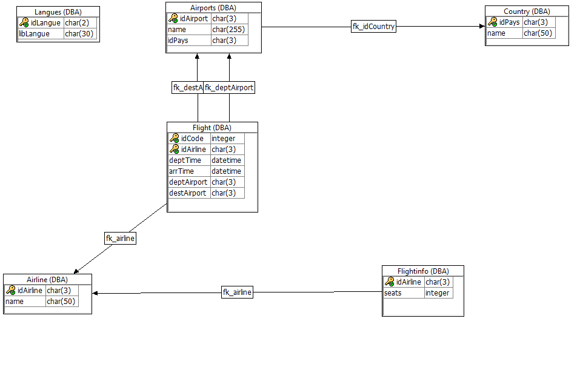

# Projet Aéroports

# Présentation de l'équipe
Pour la réalisation de ce projet, nous sommes un groupe de 4 personnes de 1TM2 :
*	Julie Fino
*	Ikram Jaujate
*	Thomas Vonck
*	Eric Suys

# Description du Projet 
Ce projet représente en page HTML les panneaux d'affichage de vols d'aéroports. L'utilisateur pourra accéder à une page web afin de voir les vols disponibles, il pourra également réaliser une requête afin de rechercher des informations sur ces vols (date départ, arrivée, aéroport de départ, aéroport de destination, nombre de sièges, ...). 
L'utilisateur pourra aussi rechercher la disponibilité des aéroports par pays (avec possibilité de réinitialiser la requête), ajouter des airlines et également ajouter des vols à la base de données via un formulaire HTML.

# Fonctionnalités principales
* Une page html comportant le panneau d’affichage des vols disponible.

* Formulaire permettant à l’utilisateur de réaliser des requêtes correspondant aux vols.

* Mais aussi, réaliser des recherches sur chaque pays, afin de voir la quantité et disponibilité des aéroports dans celui-ci.

* Permet d’ajouter des vols pour l’avenir.

# Fonctionnalités secondaires
* Possibilité de changer la langue de la page. 

# Implémentation : approche technique
Le travail est divisé en deux partie, la première c’est le backend qui correspond à la création des différentes tables SQL dans notre base de données mais aussi les procédures et les différents Web Service dont notre page aura besoin pour la réalisation des différentes tâches. De même, on aura besoin de la partie frontend qui correspond à la structure de notre page web (HTML / CSS / JS) ainsi que les différents scripts afin de pouvoir mettre notre page en forme.

### Partie back-end
1. Une base de donnée ayant les différentes tables SQL, contenant les éléments nécessaires.
2. Une base de données qui va enregistrer des vols.
3.	Un serveur web qui sera capable de nous fournir les pages HTML, JS et CSS.
4.	Des Web Services et les procédures associées pour chque un :
  *	Un Web Service capable de récupérer les vols disponibles et les placer dans l'HTML
  *	Un Web Service capable de récupérer la langue souhaitée et de pouvoir traduire la page selon celui-ci.
  *	Un Web Service capable d'ajouter dans la base de données différents vols ainsi que des compagnies aériennes.
  *	Un Web Service qui va pouvoir récupérer les données d’une recherche dans la base de données.

### Partie front-end
* Une page Web (HTLM, JS, CSS) permettant d'appeler les webservices disponibles et de traiter les réponses afin de modifier la page / la base de donnée :
  *	Changer la langue de la page.
  *	Afficher les vols disponibles.
  *	Afficher les résultats des différentes requêtes. 
    * Afficher les informations sur un vol.
    * Afficher les aéroports disponibles selon le pays proposé.
  * Ajouter à notre base de donnée une nouvelle compagnie aérienne
  * Ajouter un nouveau vol à notre base de donnée.

# Détail api rest

* webservice *toutLesVols* - Julie F.
  * PAS DE PARAMÈTRE 
  * TYPE JSON
    * Afficher la liste des vols
* webservice *TableInfo* - Ikram J.O.
  * 3 PARAMÈTRES : code | aéroportDépart | aéroportDestination
  * TYPE JSON
    * Affiche les informations sur un vol selon son code
* webservice *Pays* - Thomas V.
  * 1 PARAMÈTRE : abréviation
  * TYPE RAW
    * Affiche les aéroports disponible du pays
* webservice *getLangues* - Eric S.
  * PAS DE PARAMÈTRE
  * TYPE JSON
    *  Permet la traduction de la page via une redirection
* webservice *ajoutVols* - Julie F.
  * 6 PARAMÈTRES : code | nom | hDep | hDest | dept | dest
  * TYPE JSON
    *  Permet d'ajouter un vol dans la base de données
* webservice *ajout* - Ikram J.O.
  * 2 PARAMÈTRES : id | nom
  * TYPE JSON
    * Permet d'ajouter une compagnie
* webservice *page* avec 1 paramètre (url), type RAW 
* webservice *img* avec 1 paramètre (url), type RAW
* webservice *js* avec 1 paramètre (url), type RAW
* webservice *css* avec 1 paramètre (url), type RAW

# Détail DB
Il y a 5 tables dans la base de données :
1. *Country* dans laquelle on retrouve l'abréviation du pays et le nom de celui-ci.
     * 2 valeurs : abreviationPays | nom
2. *Airports* dans laquelle on retrouve l'abréviation de l'aéroport, son nom et l'id de son pays.
     * 3 valeurs : abreviationAéroport | nom | id
3. *Flight* dans laquelle on retruove les informations dur les vols c'est-à-dire: le code du vol, l'abréviation de l'airline, l'heure de départ et celle d'arrivée ainsi que l'aéroport de départ et celui de destination.
     * 6 valeurs : codeVol | abreviationAirline | heureDepart | heureArrivée | aeroportDépart | aéroportArrivée
4. *Airline* dans laquelle on retrouve l'abréviation de l'airline et son nom complet.
     * 2 valeurs : abreviationAirlines | nom
5. *Flightsinfo* dans laquelle on retrouve le code du vol, l'id de son airline et le nombre de sièges.
     * 2 valeurs : codeVol | idAirlines | nombreSieges
6. *Langues* dans laquelle on retrouve l'id de la langue et son nom.
     * 2 valeurs : idLangue | nomLangue

